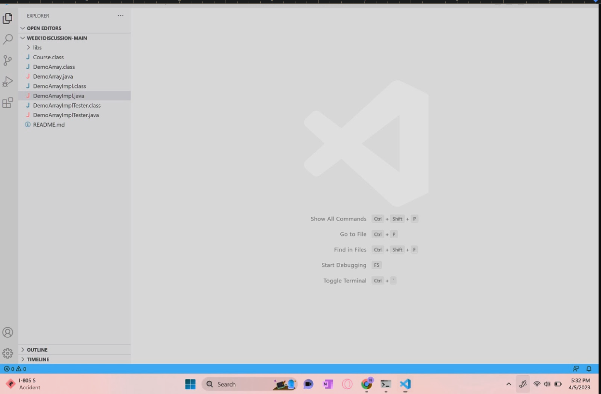
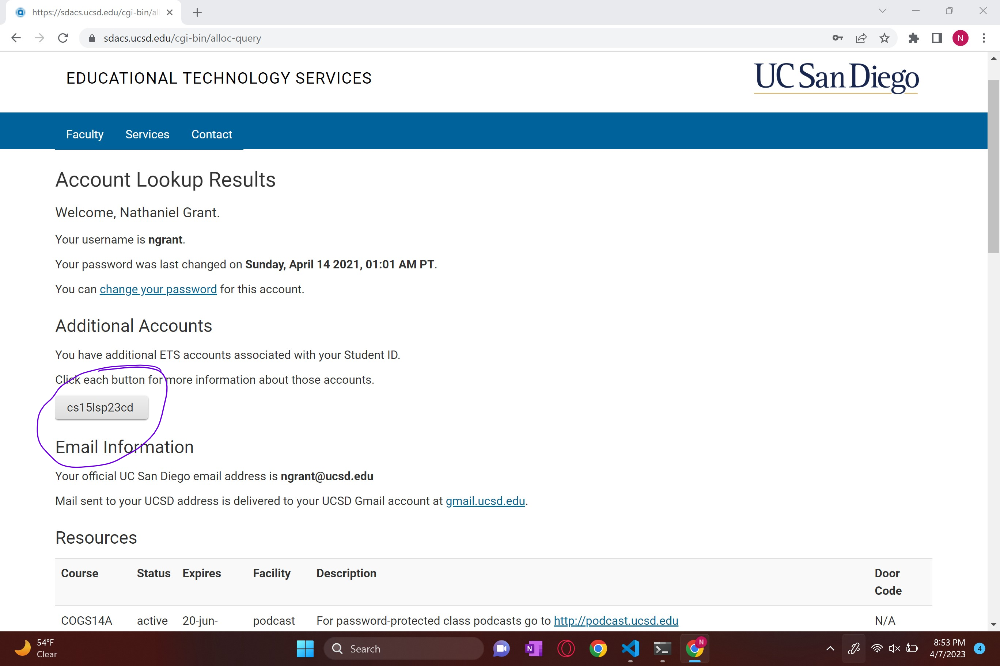

# Lab Report 1
## Downloading VSCode
* To start the process, you will need to install vscode, the software that we will be using to code, [here](https://code.visualstudio.com/download).
* Choose the platform that you are using and follow the instructions that the downloader gives you. 
* For this class you will need to also have installed java version 17 installed on your device. Once downloaded the application should look somewhat like this.

## Remotely Connecting
* To start off vist [here](https://sdacs.ucsd.edu/~icc/index.php) and submit your UCSD login info into the account lookup fields, making sure the first letter of your ID is lowercased.
* There will be button under the section Additional Accounts, which will contain your 15L username. Copy this and click the button. 

*  
