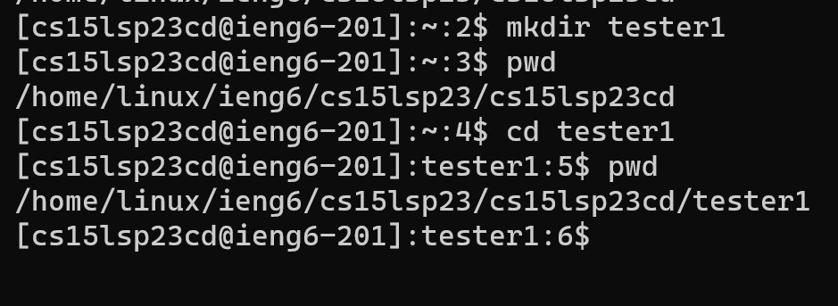

# Lab Report 1
## Downloading VSCode
* To start the process, you will need to install vscode, the software that we will be using to code, [here](https://code.visualstudio.com/download).
* Choose the platform that you are using and follow the instructions that the downloader gives you. 
* For this class you will need to also have installed java version 17 installed on your device. Once downloaded the application should look somewhat like this.


## Remotely Connecting
* To start off vist [here](https://sdacs.ucsd.edu/~icc/index.php) and submit your UCSD login info into the account lookup fields, making sure the first letter of your ID is lowercased.
* There will be button under the section Additional Accounts, which will contain your 15L username. Copy this and click the button. 

* Next you will want to use the Global Password Change Tool to reset your password, and use the username you copied from earlier. From here follow the instructions until you get to the point you can Finish Password Setup. Once you have clicked this buttion you have your account set.
* Now using any terminal on your computer, you will want to enter the command ```ssh YOURUSERNAME@ieng6.ucsd.edu```, replacing YOURUSERNAME with the username you used from before.
* You will want to type yes after getting asked about the authenticity of the host, and from there you will be asked to enter your password.
* Type in the password you set up earlier, and remember that when typing the password in it will not show anything being typed, this is just an extra security measure.
* Once in, you should get a message somewhat like this

## Trying Commands
* To test out if everything is running right, in the terminal you can start with the command ```pwd```, which should print out which directory you are working under.
* If this is correct, you can try out a multitude of other commands, such as ```cd```, ```cd ~```, ```ls```, or anything thing else that you know. 
* For example, we can try the ```pwd``` command, which prints out that I am in directory cs15lsp23cd/tester1, and then the ```mkdir``` command, which will create a new directory, or folder, you can navigate. Here is an example of someone creating a *tester1* folder and navigating around it. 

