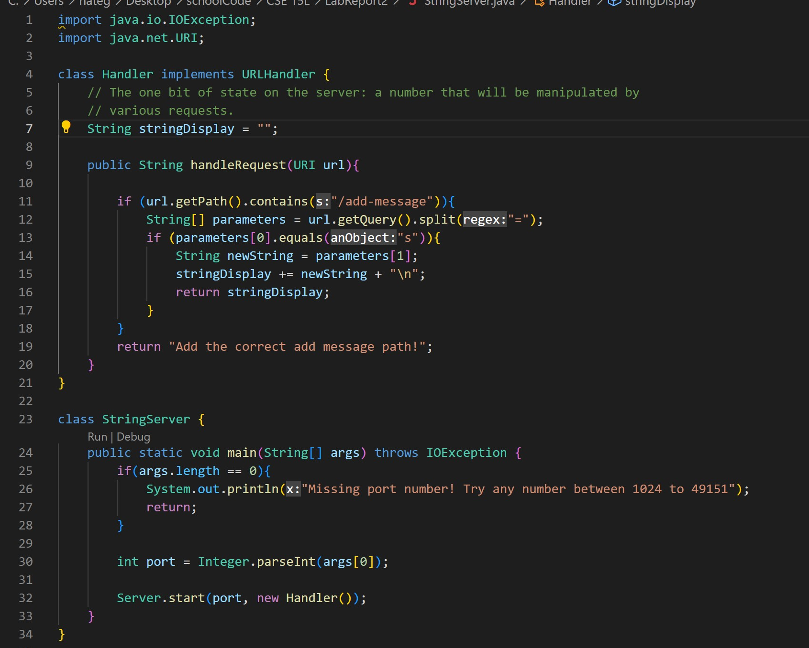

# Lab Report 1

## Part 1

### Code for StringServer



Firstly, the url path is taken in as the ```URI url``. Then` the if statement is activated as the url contains the ```/add-message```, which then activates the rest of the statements under it. The parameters array gets the query after the ```=```, which in this case is ```This is a test```. And because the query is s, the query statement is added to ```newString```. This is then added to stringDisplay, along with a newline character, ```\n```.


Again in this image, the url path is taken in as the ```URI url```. Then the if statement is activated as the url contains the ```/add-message```, which then activates the rest of the statements under it. The parameters array gets the query after the ```=```, which in this case is ```String3```. And because the query is s, the query statement is added to ```newString```. This is then added to stringDisplay, along with a newline character, ```\n```. As the website was already run a couple times, stringDisplay also contains ```This is a test``` and ```Batman``` along with their respective newline characters.

## Part 2

### A failure inducing input
```
 @Test
 public void testReversed() {
   int[] input1 = {1,2,3};
   System.out.print(ArrayExamples.reversed(input1));
   assertArrayEquals(new int[]{3,2,1}, ArrayExamples.reversed(input1));
  }
```


### A non-failing input
```
@Test
  public void testReversed() {
    int[] input1 = {0};
    System.out.print(ArrayExamples.reversed(input1));
    assertArrayEquals(new int[]{0}, ArrayExamples.reversed(input1));
  }
```


### Buggy code
```
  static int[] reversed(int[] arr) {
    int[] newArray = new int[arr.length];
    for(int i = 0; i < arr.length; i += 1) {
      arr[i] = newArray[arr.length - 1 -i];
    }
    return arr;
  }
  ```
  
 ### Debugged Code
 ```
   static int[] reversed(int[] arr) {
    int[] newArray = new int[arr.length];
    for(int i = 0; i < arr.length; i += 1) {
      newArray[i] = arr[arr.length - 1 -i];
    }
    return newArray;
  }
  ```
  In the original code, ```arr``` is being returned even though the function is meant to return a new array. On top of this, the original code was copying the contents of ```newArray``` into ```arr```, which is a problem as ```newArray``` is empty while the copying is being done. So instead of returning a new flipped array, we are essentiall returning an old erased array. So that is why I changed the return statement to return ```newArray``` instead of ```arr```, as well as fixing the variables up in the for loop.

## Part 3
Even though I am not 100% sure how the server.java file works, I did learn a lot about implementing java code through URL's. I also learned about ports and localhosts, as I never knew running servers through localhosts and specific port was a thing. I also didn't know that all public websites used ports, and they are just hidden from us, the user.
