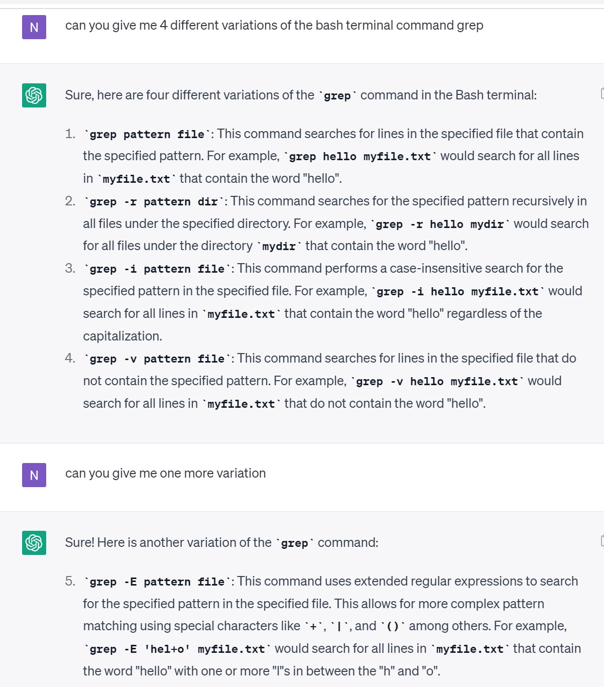
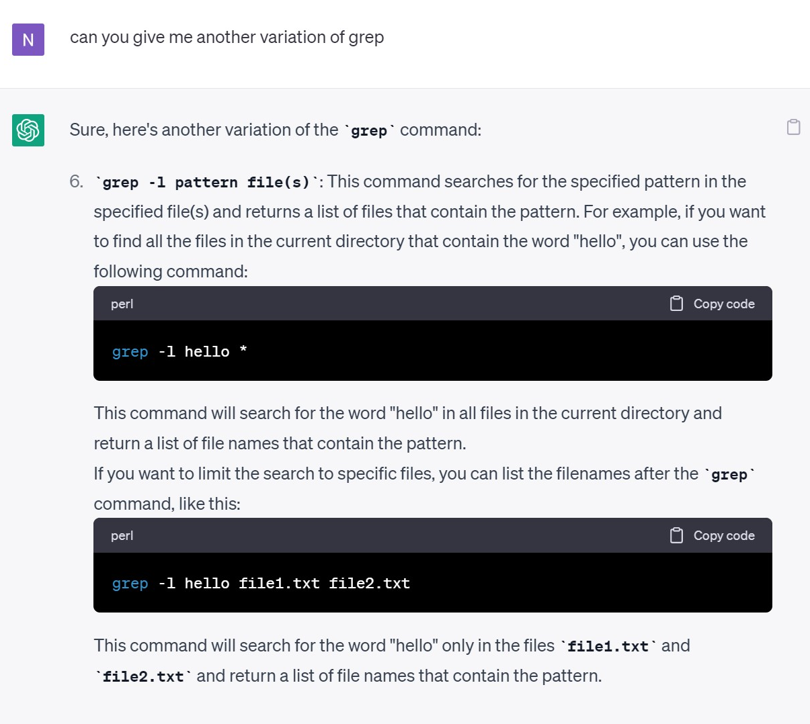
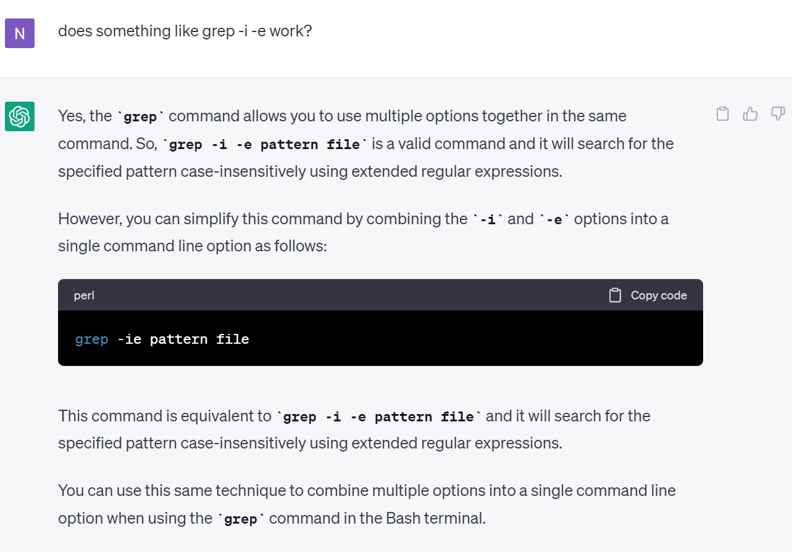

# Lab Report 3

## Source



The main and only source that I used to dive more in depth with the ```grep``` command was ChatGPT. 

### grep -r variation
Chatgpt had given me the ```grep -r``` variation, which described that this allowed me to search through file directories and find all the specified character patterns within that grouping of files.

```
$ grep -r helo biomed
biomed/1471-2180-3-10.txt:        Mycobacterium chelonae [ 32 ] . These
biomed/1471-2199-3-11.txt:        tumor cells, most of which are of epitheloid origin, become
biomed/1471-2199-3-11.txt:        fibroblasts versus apoptosis in epitheloid cells.
biomed/1471-2334-3-15.txt:          nephelometer flasks on a rotating platform (60 rpm) or
biomed/1471-2350-2-8.txt:          nephelometry [ 14]. Nephropathy was defined as a
biomed/ar328.txt:        nephelometry to disclose autoimmune phenomena and/or
biomed/ar93.txt:          human epidermal tissue. RF was tested by nephelometry.
biomed/ar93.txt:          IgM RF was measured by nephelometry, and a level
biomed/bcr458.txt:        bachelor's degree, which is 220% higher than the national
```

My first use of  ```grep -r``` was a test, to see how the variation actually worked. The command above searched through all the files in the biomed directory and found every instance where the combination ```helo``` appeared. It also specified which file each instance of it appeared, which is helpful if you wanted to do a deep dive of the specified word.

```
$ grep -r " frog " biomed
biomed/1471-2091-3-31.txt:          acids 792-816 of frog Myo1c (SVLDKSWPVPPPSLREASELLREMC;
biomed/1471-213X-1-13.txt:        active form of Notch (Nac) in frog embryos led to an
biomed/1471-213X-1-13.txt:        neurons in frog and zebrafish [ 25, 26, 27, 28]. Each of
biomed/1471-213X-1-13.txt:        of frog [ 24] and chick [ 20] and in the neural plate of
biomed/1471-213X-1-13.txt:        frog [ 25] and zebrafish [ 26, 27, 28], concomitant with
biomed/1471-213X-1-13.txt:          negative form of frog Delta-1 protein into early cleavage
biomed/1471-213X-1-6.txt:        used to fertilize frog eggs in the lab [ 25]. We rinsed the
biomed/1471-213X-3-2.txt:        duplication. Instead, when over-expressed in frog or fish
biomed/1471-2164-2-8.txt:        during early frog development [ 1 ] . Nucleoplasmin forms a
biomed/1471-2202-1-1.txt:        skin of the frog 
biomed/1471-2202-1-1.txt:        frog
biomed/1471-2202-3-4.txt:          to Ca 2+(1.8 mM in frog Ringer's solution) but not to
biomed/1471-2202-3-4.txt:          condition, whole oocytes were bathed in frog Ringer's
biomed/gb-2002-3-2-research0008.txt:        tetraploid frog 
```

One of the uses this variation could have would be the ability to search huge file directories for specific information. I chose to look through all the biomed files for the phrase ```frog```, and from here any researchers interested in frog specific testing can look into each of these files.


### grep -i variation

ChatGPT's second variation was ```grep -i```, which described that it was a case insensitive variation the original ```grep``` command.

Working back off of the previous search using ```$ grep -r " frog " biomed```, I realized that that search was not finding all cases of frog, because it was case sensitive. I was curious if I was able to use multiple of these variations in the same command, and by asking chatgpt I found out I was able to.

```
$ grep -ir " frog " biomed
biomed/1471-2091-3-31.txt:          acids 792-816 of frog Myo1c (SVLDKSWPVPPPSLREASELLREMC;
biomed/1471-213X-1-13.txt:        active form of Notch (Nac) in frog embryos led to an
biomed/1471-213X-1-13.txt:        the overexpressed Notch protein fell. Frog retinal cells
biomed/1471-213X-1-13.txt:        neurons in frog and zebrafish [ 25, 26, 27, 28]. Each of
biomed/1471-213X-1-13.txt:        of frog [ 24] and chick [ 20] and in the neural plate of
biomed/1471-213X-1-13.txt:        frog [ 25] and zebrafish [ 26, 27, 28], concomitant with
biomed/1471-213X-1-13.txt:          negative form of frog Delta-1 protein into early cleavage
biomed/1471-213X-1-6.txt:        used to fertilize frog eggs in the lab [ 25]. We rinsed the
biomed/1471-213X-3-2.txt:        duplication. Instead, when over-expressed in frog or fish
biomed/1471-2164-2-8.txt:        during early frog development [ 1 ] . Nucleoplasmin forms a
biomed/1471-2202-1-1.txt:        skin of the frog 
biomed/1471-2202-1-1.txt:        frog
biomed/1471-2202-3-4.txt:          to Ca 2+(1.8 mM in frog Ringer's solution) but not to
biomed/1471-2202-3-4.txt:          condition, whole oocytes were bathed in frog Ringer's
biomed/gb-2002-3-2-research0008.txt:        tetraploid frog 
```
While this search only brought up one extra instance of frog that was capitalized, this could help a ton when searching for phrases that can or cannot be capitalized, i.e. when frog is at the beginning of a sentence.

```
$ grep -ir " acl " biomed
biomed/1471-2474-3-3.txt:        strengths of the ACL at the strain rates of 40, and 140
biomed/1471-2474-3-3.txt:        ACL in humans and rhesus monkeys to analyze age and species
biomed/1471-2474-3-3.txt:        ACL and PCL hyperextension. In the PCL, ligament tearing
biomed/1471-2474-3-3.txt:        the ACL failure mode of Rhesus monkeys. The first study
biomed/1471-2474-3-3.txt:        et al in 1976 studied ACL failure in
biomed/1471-2474-3-3.txt:        PCL and ACL were reverse from those of the previous
biomed/gb-2003-4-2-r14.txt:          acl ) surely belong to an operon,
biomed/gb-2003-4-2-r14.txt:          start and stop codons (Figure 4). Acl exhibits strong
biomed/gb-2003-4-2-r14.txt:          the function of Acl is likely to be closer to
biomed/gb-2003-4-2-r14.txt:          acl is tightly organized with
biomed/gb-2003-4-2-r14.txt:          acl . An anthranilate-CoA ligase
biomed/gb-2003-4-2-r14.txt:          Xylella Acl exhibited greater
biomed/gb-2003-4-2-r14.txt:          If anthranilate is indeed the substrate of Acl in
biomed/gb-2003-4-2-r14.txt:          acl are problematic at the present
```

My second use of the ```grep -i``` variation was based upon the idea of non-uniformal abbreviations. This search brought up a few different variations of the abbreviation acl, which showed both different meanings of the grouping acl and the idea that sometimes these abbreviations are not uniform among the scientific community.

### grep -l variation
The 3rd variation I am using that ChatGPT referred to me is ```grep -l```. The chatbot says that this search returns only the name of files that contains the specified variations.

```
$ grep -li " frog " *
1471-2091-3-31.txt
1471-213X-1-13.txt
1471-213X-1-6.txt
1471-213X-3-2.txt
1471-2164-2-8.txt
1471-2202-1-1.txt
1471-2202-3-4.txt
gb-2002-3-2-research0008.txt
```

This use of ```grep -l``` returns to us all the files that contain the word "frog"(case-insensitive). Again, this could be a quick way to get the files that do mention frog research, and from there we can grep specific keywords such as specific organs or proteins that may be involved with these frogs.

```
$ grep -li cycloheximide *
1471-2091-3-14.txt
1471-2121-3-11.txt
1471-2121-3-22.txt
1471-2121-3-8.txt
1471-213X-2-8.txt
1471-213X-3-3.txt
1471-2156-3-4.txt
1471-2180-3-5.txt
1471-2202-4-5.txt
1475-2867-3-12.txt
1475-2867-3-2.txt
1475-4924-1-10.txt
1476-9433-1-2.txt
ar331.txt
```
Again, this variation of grep is very useful when it comes to traversing large directories. This use of ```grep -l``` looks for all instances of cycloheximide and returns every file that contains it.


