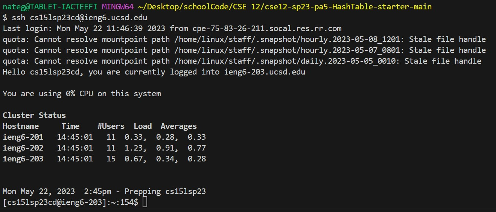
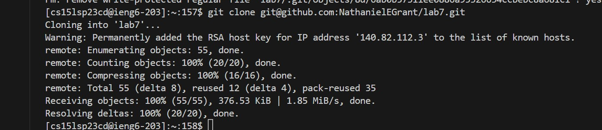
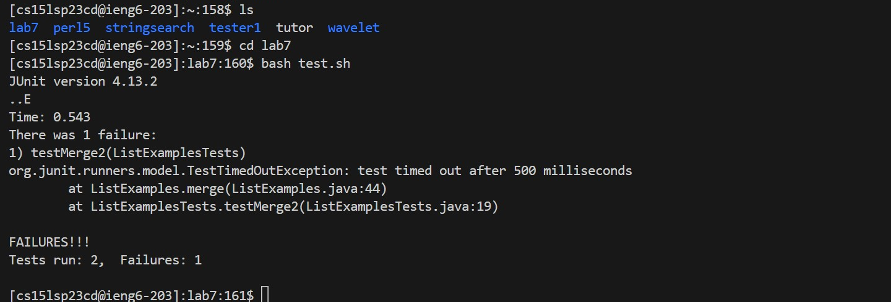
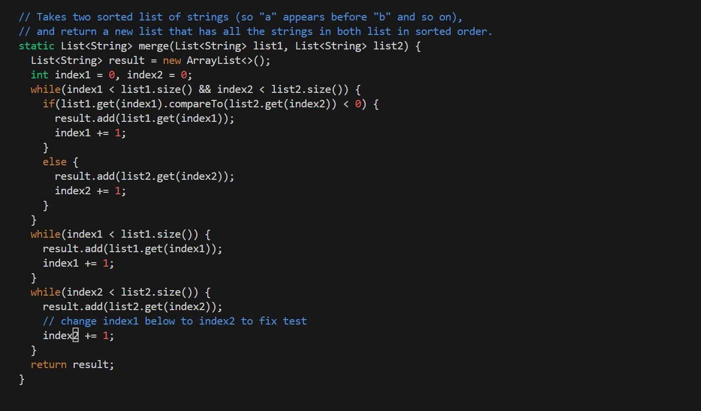
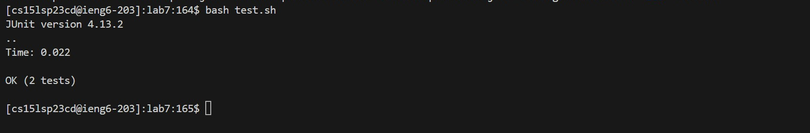
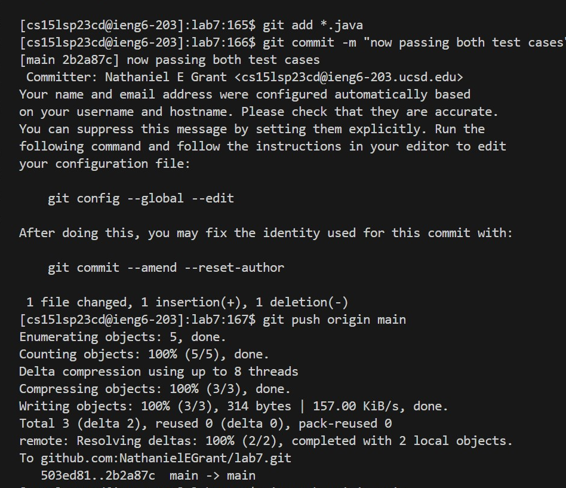

# Lab Report 4

## Step 4

```ssh cs15lsp23cd@ieng6.ucsd.edu```


## Step 5

First, I forked the given repository into my own GitHub account, and from there in my ssh account used the command ```git clone git@github.com:NathanielEGrant/lab7.git``` and got the repository into my ssh account.


## Step 6

To run the tests, first I moved into the lab7 directory using the command ```cd lab7```. Next, I used the given bash script by typing in ```bash test.sh```.


## Step 7

To start editing the incorrect file, I typed ```vim ListExamples.java```, which brought me into the vim editor to look at the file. From here, my keystrokes were ```<shift + G>, <up>, <up>, <up>, <up>, <up>, <up>, e, x, i, 2, <esc>, <:wq>```.


## Step 8

To retest the tests, I used the same bash command from earlier. 
```bash test.sh```


## Step 9

To upload the changes to github, first I used the command ```git add *.java```, which readies all the java files in the directory lab7.
Next I used ```git commit -m "now passing both test cases"```, which saved the changes with the commit message saying that we are now passing both junit tests.
Finally, to upload these changes to the lab7 repository on github I used the command ```git push origin main```.

